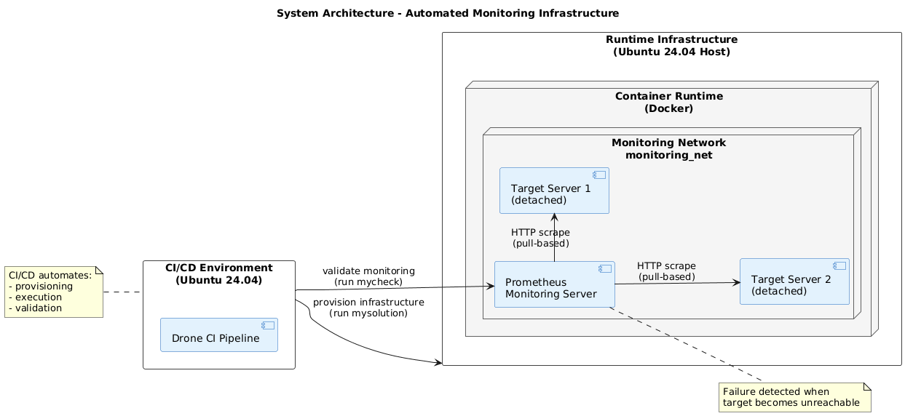
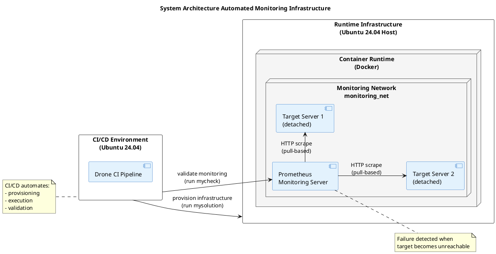
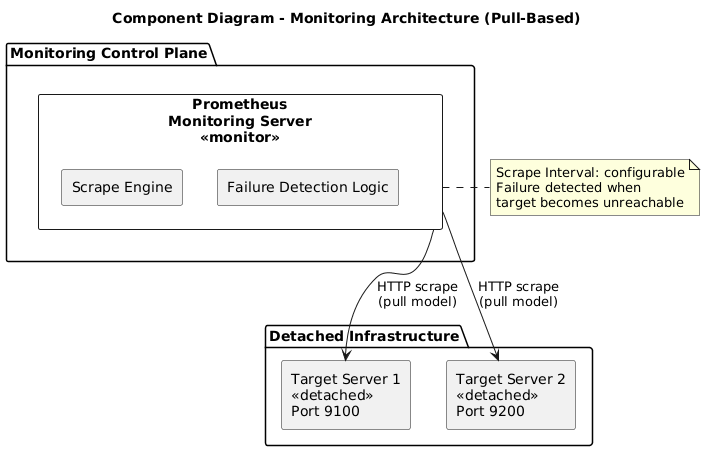
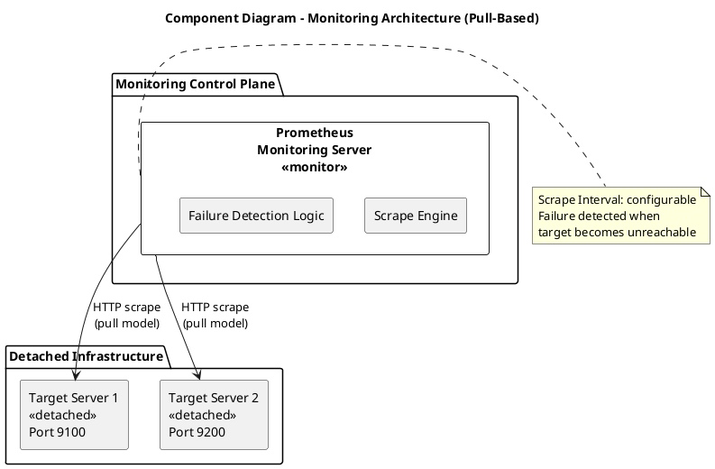
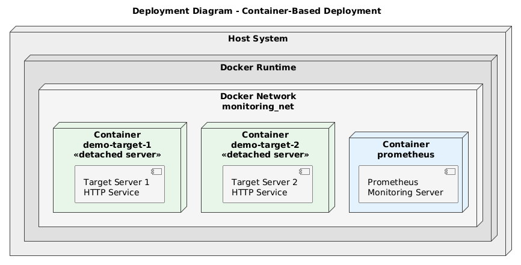
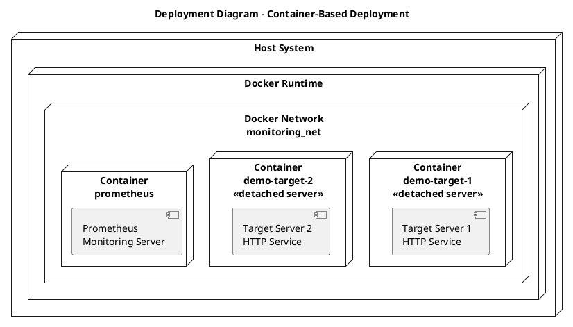

# 
<strong>Automated Infrastructure Monitoring with Prometheus</strong>

## 
 ***VLBA Cloud Technology - Final Exercise - Dhruvi Swadia***  

## Index

1. [Introduction](#1-introduction)
2. [Use Case and Motivation](#2-use-case-and-motivation)
3. [Technology Overview](#3-technology-overview)
4. [Ubuntu 24.04 Execution Environment](#4-ubuntu-2404-execution-environment)
5. [Linux Technologies Used](#5-linux-technologies-used)
6. [System Architecture](#6-system-architecture)
7. [Architecture and Design](#7-architecture-and-design)
8. [Infrastructure as Code Approach](#8-infrastructure-as-code-approach)
9. [Monitoring Validation Strategy](#9-monitoring-validation-strategy)
10. [Resource Constraints](#10-resource-constraints)
11. [Variables and Possible Variations](#11-variables-and-possible-variations)
12. [Conclusion](#12-conclusion)
13. [References](#13-references)

---

## 1. Introduction

This project implements an automated infrastructure monitoring solution using Prometheus. The system follows Infrastructure as Code (IaC) principles and is fully validated through a CI/CD pipeline.

The solution provisions detached servers, configures monitoring dynamically, and verifies monitoring correctness deterministically. The entire setup is reproducible, resource-efficient, and suitable for live demonstration.

---

## 2. Use Case and Motivation

Modern distributed systems require continuous monitoring to detect failures early and reliably. Manual monitoring configurations are error-prone, difficult to reproduce, and hard to validate automatically.

This project addresses the following goals:

- Automated provisioning of monitoring infrastructure  
- Monitoring of detached servers across a network  
- Deterministic validation of monitoring correctness  
- CI/CD-driven verification to ensure repeatability  

The system mirrors real-world infrastructure where monitoring services and monitored systems are decoupled and communicate only over the network.

---

## 3. Technology Overview

The following technologies are used:

- **Prometheus** – Pull-based monitoring system and time-series database  
- **Docker** – Container-based virtualization  
- **Python** – Infrastructure automation and validation logic  
- **Drone CI** – Continuous Integration pipeline  
- **Linux (Ubuntu 24.04)** – Execution environment  

**Docker** is used to provision isolated servers in the form of containers. Each
container behaves as an independent server with its own lifecycle and network
identity, enabled by Linux namespaces and control groups.

**Prometheus** is used as the monitoring system. It periodically scrapes HTTP
endpoints exposed by target servers using a pull-based monitoring model and
stores the collected metrics in a time-series database.

The Prometheus monitoring server is executed using the official Docker image,
which provides a standardized and reproducible runtime environment.

---

## 4. Ubuntu 24.04 Execution Environment

The solution supports only **Ubuntu 24.04** Linux-based systems as hosts to run the solution. The Ubuntu 24.04 host provides the necessary components for the solution, as it contains the Linux kernel, networking stacks, and container runtime required for each of these components to run properly.

Since the CI/CD pipeline runs on an Ubuntu 24.04 runner, the OS in which provisioning and validating occur is consistent with the OS in which the solution is running. In the real world, all the containers created through Docker will also use the same Ubuntu kernel as the host operating system on which they run.

While containers use minimal base images, they share the Ubuntu 24.04 host kernel, satisfying the operating system requirement at runtime.

---

## 5. Linux Technologies Used

The project makes use of core Linux technologies:
- Linux namespaces and cgroups for container isolation
- Linux virtual networking for inter-container communication
- Linux process lifecycle management to simulate failures
- Shell-based automation in CI/CD

These mechanisms enable reproducible infrastructure provisioning and realistic monitoring scenarios.

---

## 6. System Architecture

The system consists of two logical layers:

- A **CI/CD control plane** responsible for provisioning and validation  
- A **runtime infrastructure** hosting detached servers and a monitoring server  

**System Architecture Diagram – PlantUML Source**

[PlantUML System Architecture Reference](https://plantuml.com/architecture-diagram)

### Architecture Summary

- CI/CD provisions infrastructure using automation scripts  
- Detached servers expose HTTP endpoints  
- Prometheus scrapes targets using a pull-based model  
- Failures are detected through health state changes  

---

## 7. Architecture and Design

### 7.1 Component Diagram

The component diagram illustrates the logical structure of the monitoring system and the interaction between Prometheus and detached infrastructure.

**Component Diagram – PlantUML Source**

[PlantUML Component Diagram Reference](https://plantuml.com/component-diagram)

### 7.2 Deployment Diagram

The deployment diagram illustrates how the monitoring solution is deployed as containerized services on a Docker-enabled host system. Each container represents an isolated server instance connected through a dedicated Docker network.

**Deployment Diagram – PlantUML Source**

[PlantUML Deployment Diagram Reference](https://plantuml.com/deployment-diagram)

---
## 8. Infrastructure as Code Approach

The infrastructure is fully described using executable scripts:

- mysolution - provisions Docker networks, starts detached servers, dynamically generates Prometheus configuration, and launches the monitoring server.
- mycheck - validates monitoring correctness by querying the Prometheus HTTP API and simulating infrastructure failure.

This approach guarantees idempotency, reproducibility, and automated verification.

---

## 9. Monitoring Validation Strategy

Verifying the correctness of monitoring validation is accomplished by ensuring that all targets are located; in addition, the CI/CD determines failure of the monitored target by its inaccessibility. This validation is deterministically performed and can occur in a non-interactive manner within the CI/CD environment.

---

## 10. Resource Constraints

The project implements this monitoring automation for environments where resources may be limited due to infrastructure design constraints. The CI/CD implementation uses 'lightweight' containers to implement the monitoring solution, and CI/CD also intentionally excludes the use of visualization tools (e.g., Grafana) from the CI/CD pipeline in order to promote replicability.

---

## 11. Variables and Possible Variations

To support a live showcase and demonstrate reusability, the monitoring infrastructure is parameterized using externalized configuration variables. These variables are defined in **myexercise.var.md** and are consistently used across the provisioning and validation scripts.

By modifying these values, the same Infrastructure-as-Code logic can be reused to demonstrate different monitoring scenarios during the presentation without changing the core implementation.

| Variable | Purpose | Example Values |
|---------|--------|----------------|
| TARGET_NAME | Logical server identifier | demo-target |
| TARGET_PORTS | Exposed service ports | 9100, 9200 |
| SCRAPE_INTERVAL | Monitoring frequency | 5s |

These variables ensure that the infrastructure remains adaptable while preserving deterministic behavior required for automated validation in CI/CD environments.

---

## 12. Conclusion

This project demonstrates how infrastructure monitoring can be automated, validated, and integrated into a CI/CD workflow. By treating monitoring as code, failures are detected reliably in a distributed Linux-based environment with detached servers and minimal resource usage.

---

## 13. References

[1] [Canonical Ltd. Ubuntu 24.04 LTS Documentation.](https://ubuntu.com/server/docs)  
Official documentation for Ubuntu Server 24.04 LTS, describing system architecture, kernel behavior, and container runtime support.

[2] [Prometheus Authors. Prometheus: Monitoring System and Time Series Database.](https://prometheus.io/docs/introduction/overview/)  
Official overview of Prometheus, its pull-based monitoring model, and reliability guarantees.

[3] [Cloud Native Computing Foundation. Prometheus Docker Image.](https://hub.docker.com/r/prom/prometheus)  
Docker image documentation for running Prometheus in containerized environments.

[4] [Docker Inc. Docker Documentation.](https://docs.docker.com)  
Official Docker documentation covering container runtime behavior, networking, and isolation mechanisms.

[5] [PlantUML Project. PlantUML Documentation.](https://plantuml.com)  
Documentation for PlantUML syntax used to generate component, deployment, and system architecture diagrams.

[6] [Gintowt, Tomasz. Monitoring Docker Containers with Prometheus.](https://tomasz-gintowt.medium.com/step-by-step-guide-monitoring-docker-containers-with-prometheus-ea90487bece0)  
Step-by-step guide demonstrating container monitoring patterns with Prometheus.

[7] Prometheus and Grafana: A Metrics-Focused Monitoring Stack. ResearchGate, 2023.  
Academic discussion of Prometheus-based monitoring architectures and observability concepts.

[8] OpenAI. ChatGPT: Large Language Model Assistance.  
Used for assistance with explanations, documentation structuring, PlantUML syntax, and validation logic through prompt-based interaction.
